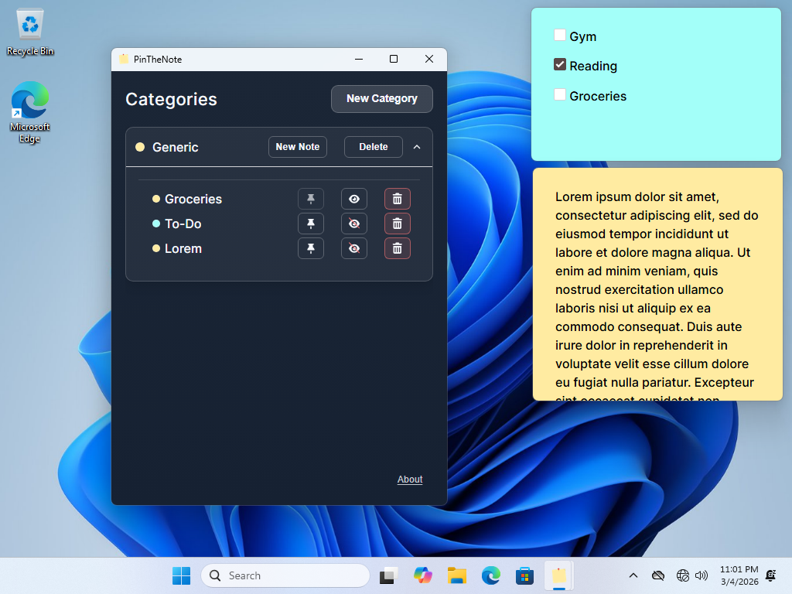

# PinTheNote

PinTheNote is a desktop sticky-notes app focused on quick capture and clean organization.
Create notes inside categories, open them as floating windows, and pin important notes to stay always on top while you work.

## Screenshots



## Core Features

- Category-based organization for notes.
- Floating sticky-note windows per note.
- Pin / unpin notes as **always-on-top** windows.
- Show or hide note windows from the main overview.
- In-place note editing with quick keyboard shortcuts.
- Per-note and per-category color customization.
- Note content modes: plain text, Markdown, or HTML.
- Note zoom controls for better readability.

## Downloads

Prebuilt binaries are available from GitHub Releases:

- Windows
- Linux
- macOS

➡️ [Download latest release](https://github.com/eryalito/pinthenote/releases/latest)

## Run in Development

### Requirements

- Go
- Node.js
- Wails v3 CLI

### Start

```bash
wails3 dev
```

## Build

```bash
wails3 build
```

The resulting binaries are generated in the `build/` directory.

## Tech Stack

- Go (backend)
- Wails v3 (desktop runtime)
- React + TypeScript (frontend)
